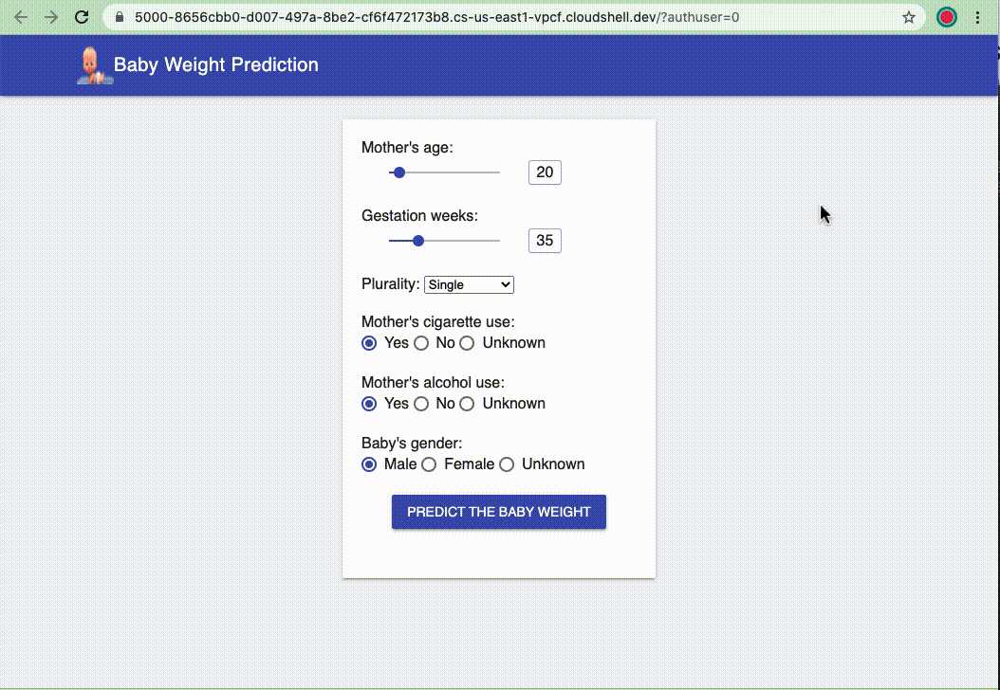

# End-to-End-ML-Project: GCP-BigQuery-Keras-Predicting-BabyWeight-NatalityDataset
- In this end-to-end Machine Learning project, we use the  [Natality dataset](https://console.cloud.google.com/bigquery?project=bigquery-public-data&p=publicdata&d=samples&t=natality&page=table), which has details on US births from 1969 to 2008 and is a publicly available dataset in [BigQuery](https://cloud.google.com/bigquery/), to build and deploy a [Deep-Wide-Cross Keras model](https://keras.io/examples/structured_data/wide_deep_cross_networks/) *at scale* on [Google Cloud AI Platform](https://cloud.google.com/ai-platform/docs/technical-overview) to predict the weight for a baby before he/she is born. At the end, a [Flask](https://www.fullstackpython.com/flask.html) web form application is then created to show how the model can interact with a web application.

- The Natality dataset is a relatively large dataset that has almost 138 million rows and 31 columns in which `weight_pounds` is the target - a continuous value - we train a model to predict, based on values of the other feature columns. So, this is typically a **supervised regression problem**.
- To complete this project, we separate the work into 6 `Jupiter notebooks`. Each notebook performs a main step in an ***End-to-end Machine Learning Project with a large dataset***:
  - `1_explore_full_dataset.ipynb`: explores and visualizes the Natality dataset using BigQuery calls.
  - `2_prototype_model.ipynb`: uses BigQuery and Pandas to create a small subsample dataset and then uses this sub-dataset to develop a Deep-Wide-Cross Keras model locally.
  - ``Preparing the training and evaluation datasets with the entire dataset using [Cloud Dataflow](https://cloud.google.com/dataflow)
  1. Training the production model using Cloud ML Engine
  2. Deploying a prediction service as a Flask application using App Engine
- Structures of this projects:
- 

